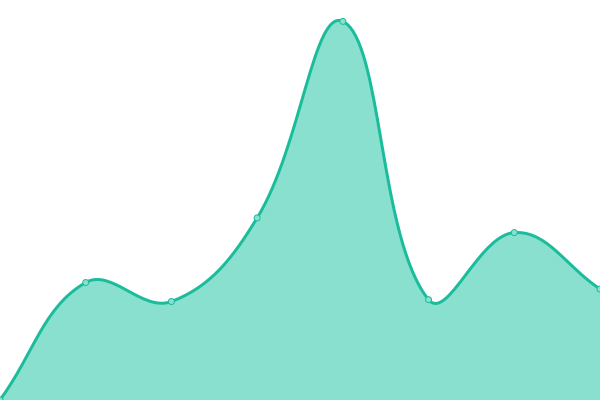

# [📈 Live Status](https://status.marnick.dev): <!--live status--> **🟩 All systems operational**

This repository contains the open-source uptime monitor and status page for [Marnick](marnick.dev), powered by [Upptime](https://github.com/upptime/upptime).

With [Upptime](https://upptime.js.org), you can get your own unlimited and free uptime monitor and status page, powered entirely by a GitHub repository. We use [Issues](https://github.com/marnick-s/status/issues) as incident reports, [Actions](https://github.com/marnick-s/status/actions) as uptime monitors, and [Pages](https://status.marnick.dev) for the status page.

<!--start: status pages-->
<!-- This summary is generated by Upptime (https://github.com/upptime/upptime) -->
<!-- Do not edit this manually, your changes will be overwritten -->
<!-- prettier-ignore -->
| URL | Status | History | Response Time | Uptime |
| --- | ------ | ------- | ------------- | ------ |
|  [marnick.dev](https://marnick.dev) | 🟩 Up | [marnick-dev.yml](https://github.com/marnick-s/status/commits/HEAD/history/marnick-dev.yml) | 

 543ms
     
 | 

<a href="https://status.marnick.dev/history/marnick-dev">100.00%</a>
    

|  [Analytics](https://analytics.marnick.dev) | 🟩 Up | [analytics.yml](https://github.com/marnick-s/status/commits/HEAD/history/analytics.yml) | 

 977ms
     
 | 

<a href="https://status.marnick.dev/history/analytics">100.00%</a>
    

|  [NHL Stenden roosters](https://nhlstendenroosters.nl) | 🟩 Up | [nhl-stenden-roosters.yml](https://github.com/marnick-s/status/commits/HEAD/history/nhl-stenden-roosters.yml) | 

 818ms
     
 | 

<a href="https://status.marnick.dev/history/nhl-stenden-roosters">100.00%</a>
    

|  [Typensneek](https://typensneek.nl) | 🟩 Up | [typensneek.yml](https://github.com/marnick-s/status/commits/HEAD/history/typensneek.yml) | 

 1719ms
     
 | 

<a href="https://status.marnick.dev/history/typensneek">100.00%</a>
    

|  [Smederij Sieses](https://smederijsieses.nl) | 🟩 Up | [smederij-sieses.yml](https://github.com/marnick-s/status/commits/HEAD/history/smederij-sieses.yml) | 

 1410ms
     
 | 

<a href="https://status.marnick.dev/history/smederij-sieses">100.00%</a>
    

|  [Yn 'e Mar](https://ynemar.nl) | 🟩 Up | [yn-e-mar.yml](https://github.com/marnick-s/status/commits/HEAD/history/yn-e-mar.yml) | 

 784ms
     
 | 

<a href="https://status.marnick.dev/history/yn-e-mar">100.00%</a>
    

<!--end: status pages-->

[**Visit our status website →**](https://status.marnick.dev)

## 📄 License

- Powered by: [Upptime](https://github.com/upptime/upptime)
- Code: [MIT](./LICENSE) © [Marnick](marnick.dev)
- Data in the `./history` directory: [Open Database License](https://opendatacommons.org/licenses/odbl/1-0/)
